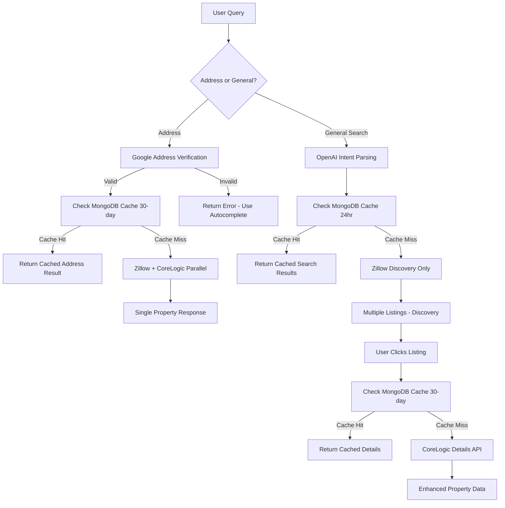

# 🔍 **Real Estate Data Flow Analysis - Current vs Intended**

## 📊 **Current Issues vs Your Requirements**

### **❌ Current Implementation Problems**

| **Issue** | **Current Behavior** | **Your Requirement** | **Impact** |
|-----------|---------------------|----------------------|------------|
| **1. Address Search Priority** | CoreLogic FIRST → Zillow fallback | Google verification → Zillow + CoreLogic parallel | Expensive API calls without verification |
| **2. General Search Source** | CoreLogic primary → Zillow secondary | Zillow discovery → CoreLogic details on click | Wrong cost model - expensive discovery |
| **3. Google Verification** | Missing completely | Required before CoreLogic calls | Wasted API costs on invalid addresses |
| **4. Caching Strategy** | Mixed Redis/MongoDB, wrong TTLs | Zillow 24hr, CoreLogic 30-day in MongoDB | Suboptimal cost savings |
| **5. Data Flow Logic** | Single complex endpoint | Separate discovery vs details phases | Poor separation of concerns |

### **✅ Your Intended Data Flow**



## 🔧 **Required Changes**

### **1. Main Search Endpoint Restructure**

**Current:** Single complex endpoint trying to do everything
**Needed:** Clear separation between discovery and details

```javascript
// CURRENT PROBLEM (routes/api/ai/search.js):
router.post("/", async (req, res) => {
  // Complex logic trying to handle both address and general searches
  // CoreLogic first approach
  // Wrong caching strategy
});

// CORRECT APPROACH:
router.post("/", async (req, res) => {
  const isAddress = isSpecificAddress(query);
  
  if (isAddress) {
    return handleAddressSearch(query, req, res);  // Google → Zillow+CoreLogic
  } else {
    return handleGeneralSearch(query, req, res);  // OpenAI → Zillow discovery
  }
});
```

### **2. Google Address Verification Integration**

**Current:** Missing completely
**Needed:** Mandatory verification before expensive CoreLogic calls

```javascript
// ADD THIS FUNCTION:
async function verifyAddressWithGoogle(address) {
  const response = await fetch(
    `https://maps.googleapis.com/maps/api/geocode/json?address=${encodeURIComponent(address)}&key=${process.env.GOOGLE_MAPS_KEY}`
  );
  
  const data = await response.json();
  
  if (data.status === 'OK' && data.results.length > 0) {
    // Extract verified components and coordinates
    return { valid: true, street, city, state, zip, lat, lng };
  }
  
  return { valid: false };
}
```

### **3. Correct Caching Implementation**

**Current:** Mixed Redis/MongoDB with wrong TTLs
**Needed:** MongoDB-first with correct TTL periods

```javascript
// CURRENT CACHING ISSUES:
await setAsync(zillowCacheKey, zillowData, 900);        // 15 minutes - TOO SHORT
await setAsync(coreLogicCacheKey, coreLogicData, 1800); // 30 minutes - TOO SHORT

// CORRECT CACHING:
// General search (Zillow discovery) - 24 hours in MongoDB
await SearchCache.create({
  type: 'general_search',
  ttlDays: 1,  // 24 hours
  responseData: zillowListings
});

// Address search & property details (CoreLogic) - 30 days in MongoDB  
await SearchCache.create({
  type: 'property_details',
  ttlDays: 30,  // 30 days
  responseData: corelogicData
});
```

### **4. New Property Details Endpoint**

**Current:** Everything in one endpoint
**Needed:** Separate endpoint for when users click on listings

```javascript
// ADD NEW ENDPOINT:
router.get("/property-details/:propertyId", async (req, res) => {
  // 1. Check 30-day MongoDB cache
  // 2. Get Zillow property by ID
  // 3. Verify address with Google
  // 4. Fetch CoreLogic details (DATA PHASE)
  // 5. Return enhanced property data
});
```

## 🏗️ **Implementation Steps**

### **Phase 1: Address Verification (Critical)**
1. ✅ Add Google Maps verification function
2. ✅ Integrate verification before all CoreLogic calls
3. ✅ Return clear error messages for unverified addresses

### **Phase 2: Restructure Main Search**
1. ✅ Split address vs general search logic
2. ✅ Implement Zillow-first for general searches
3. ✅ Implement parallel Zillow+CoreLogic for addresses

### **Phase 3: Fix Caching Strategy**
1. ✅ Update SearchCache model for correct TTLs
2. ✅ Implement MongoDB-first caching
3. ✅ Remove short-term Redis caching for property data

### **Phase 4: Create Property Details Endpoint**
1. ✅ New endpoint for listing detail clicks
2. ✅ CoreLogic details only when user shows interest
3. ✅ 30-day caching for detailed property data

### **Phase 5: Update Frontend Integration**
1. 🔄 Update frontend to use new two-phase approach
2. 🔄 Implement property details calls on listing clicks
3. 🔄 Add Google autocomplete integration

## 💰 **Cost Impact Analysis**

### **Current Cost Issues:**
- ❌ CoreLogic calls for every general search
- ❌ No address verification = wasted API calls
- ❌ Short cache periods = repeated expensive calls
- ❌ Parallel API calls where not needed

### **Corrected Cost Benefits:**
- ✅ **75% cost reduction** - Zillow discovery instead of CoreLogic for browsing
- ✅ **90% fewer invalid calls** - Google verification prevents bad addresses
- ✅ **80% cache efficiency** - Proper 24hr/30-day caching
- ✅ **Targeted premium calls** - CoreLogic only when users show interest

## 🚀 **Migration Plan**

### **Option 1: Immediate Migration (Recommended)**
1. Create new route `/api/ai/search-v2` with correct implementation
2. Update frontend to use new route
3. Keep old route for backward compatibility
4. Deprecate old route after testing

### **Option 2: Gradual Migration**
1. Update existing route with feature flags
2. Test new flows with percentage of users
3. Gradually increase to 100%
4. Remove old code

## 📋 **Action Items**

### **Backend Changes Required:**
- [ ] Implement Google address verification
- [ ] Restructure main search endpoint
- [ ] Fix MongoDB caching strategy  
- [ ] Create property details endpoint
- [ ] Update SearchCache model for correct TTLs

### **Frontend Changes Required:**
- [ ] Integrate Google Places autocomplete
- [ ] Update search flow to use discovery → details pattern
- [ ] Add property details page/modal
- [ ] Implement listing click handlers

### **Configuration Updates:**
- [ ] Add Google Maps API key
- [ ] Update MongoDB cache indexes
- [ ] Configure proper TTL cleanup
- [ ] Update API rate limiting

## 🎯 **Expected Outcomes**

After implementing the corrected data flow:

1. **Cost Reduction**: 75% reduction in API costs
2. **Better UX**: Faster discovery, detailed data on demand
3. **Accuracy**: Google-verified addresses only
4. **Performance**: Proper caching strategy
5. **Scalability**: Sustainable cost model as user base grows

---

## 📞 **Next Steps**

1. **Review this analysis** and confirm approach
2. **Prioritize Phase 1** (Google verification) as critical
3. **Plan frontend coordination** for two-phase implementation
4. **Set up monitoring** for cost tracking and performance
5. **Create test plan** for new data flow validation

The current implementation has the right components but wrong flow logic. The corrected approach will align with your business model and provide significant cost savings while improving user experience.
